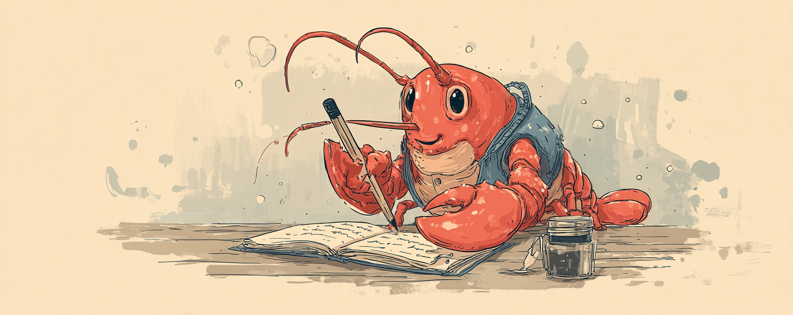

# Slipbot



**Agentic note-taking optimized for MoltBot.** Designed to make note capture frictionless for humans while your AI assistant handles organization, linking, and knowledge graph maintenance.

## What is Slipbot?

Slipbot is an agentic knowledge management system built for MoltBot and Clawdbot that eliminates the overhead of maintaining a personal knowledge graph. Instead of worrying about organization, tags, categories, or where things go, you just capture your thoughts naturally and let your AI agent handle everything else.

Your job: **Think and capture.**  
Agent's job: **Organize, link, and maintain.**

## How It Works

The workflow is simple:

1. Share a thought with your AI assistant using simple prefixes:
   - `- Research idea about spaced repetition`
   - `> The best time to plant a tree was 20 years ago ~ proverb, Chinese Proverb`
   - `! What if we built a knowledge graph that maintains itself?`
   
2. Your AI processes and organizes the note automatically

3. Your second brain grows without manual maintenance

That's it. No folders to organize, no tags to remember, no systems to maintain.

## Installation

### Requirements

- A MoltBot or Clawdbot installation
- Syncthing configured (for file sync between devices)

### Setup

1. Clone this repository into your sync folder
2. Your AI assistant will recognize note capture patterns automatically
3. Notes are stored in `sync/slipbox/` with automatic organization

### For MoltBot/Clawdbot Users

Your AI assistant will:
- Automatically recognize when you're capturing a note
- Create properly formatted markdown files
- Link related notes in your knowledge graph
- Maintain the graph index for fast queries
- Handle tagging based on content

No configuration needed. Just start capturing notes.

## Usage

### Basic Note Capture

```
- Research idea: explore the relationship between retrieval practice and spaced repetition
```

### Capture Quotes

```
> The best time to plant a tree was 20 years ago. The second best time is now. ~ proverb, Chinese Proverb
```

### Ideas

Prefix with `!` for automatic idea detection:
```
! What if we used event sourcing for the file processing pipeline?
```

### Journal Entries

Prefix with `*` for automatic journal entry detection:
```
* Today's stand-up went really well. The team is aligned on the Lambda migration.
```

### With Source Attribution

Use `~` to add source information:

```
> All models are wrong, but some are useful. ~ article, Robustness in Statistics by George Box
```

Your AI will check existing notes first, then use the provided source information.

## Querying Your Knowledge Graph

Ask your AI assistant naturally:
- "Show me notes about spaced repetition"
- "Find quotes from George Box"
- "What notes link to the Lambda migration idea?"
- "What have I written about performance optimization?"

## File Structure

```
sync/
├── slipbox/
│   ├── 20260131-041700-note-title.md
│   ├── 20260131-042000-another-note.md
│   └── .graph/
│       └── graph.json              # Knowledge graph index
```

## Note Format

Each note is a markdown file with YAML frontmatter:

```yaml
---
title: "Knowledge Graph Design Thoughts"
date: 2026-01-25T14:30:22-05:00
type: idea
tags: [systems, notes, automation]
source:
  title: "Thinking, Fast and Slow"
  type: "book"
  author: "Daniel Kahneman"
links:
  - id: "20260120-093045-compound-interest"
    type: related
    reason: "Both discuss emergent complexity"
---

Note contents here in markdown...
```

## Why Slipbot?

Traditional second brain systems fail because of maintenance overhead:

- Deciding where notes go
- Creating and maintaining taxonomies
- Linking related notes manually
- Keeping everything organized

Slipbot removes all of that. Your only job is to get thoughts out of your head. Your AI does the rest.

## How Linking Works

Your AI assistant automatically:
- Analyzes new note content against existing notes
- Identifies connection types:
  - **related**: Similar topic or theme
  - **extends**: Builds on or expands another note
  - **contradicts**: Opposing viewpoint or information
  - **references**: Mentions same person, book, concept
  - **supports**: Provides evidence for another note
- Updates frontmatter with bidirectional links (minimum 0.75 confidence)

## Tagging Philosophy

Slipbot uses object-based tagging:
- Tags are specific objects or concepts found in the note
- Not broad categories like "productivity" or "ideas"
- Object-based tags create precise connections
- Focus on nouns: specific people, tools, techniques, systems

**Example:**
- ❌ Broad: `[productivity, work, improvement]`
- ✅ Specific: `[pomodoro-technique, deep-work, Cal-Newport]`

## Status

Slipbot is actively maintained. It's functional and useful for daily note capture with AI assistants.

## Contributing

Issues and pull requests are welcome. This is an evolving project built for the AI assistant community.

## License

GPL-3.0 - See [LICENSE](LICENSE) for details.
